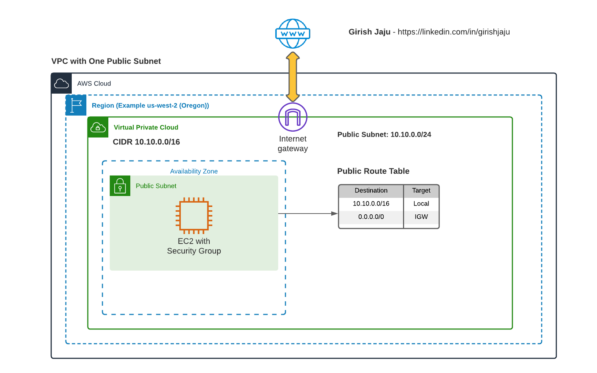

# Setup AWS VPC with One Public Subnet

## Architecure

## Detailed Steps:
### VPC 1
1. Create a VPC named VPC-1, in us-west-2 (Oregon region) with CIDR range 10.10.0.0/16
2. Create an Internet Gateway
3. Associate Internet Gateway to the VPC
4. Create a Public named VPC-1-Public-Subnet with CIDR range (10.10.0.0/24)
5. Create a Route table named (VPC-1-RT)
6. Add a route to 0.0.0.0/0 to Internet Gateway
7. Add VPC-1-Public-Subnet to the Route table
8. Make sure Subnet setting has Auto assign Public IP, so the EC2 machine can get a Public IP, we need it for SSH access
9. Create the Key Value Pair (For SSH'ing to EC2)

### EC2 on VPC 1 Public Subnet
1. Lauch an EC2 machine with t2.micro
2. On the Security Group setting, create a new Security Group - VPC-1-Public-SG  
   Allow SSH access from your IP Address 
3. Create an IAM role (VPC-1-EC2-S3-Role) for EC2 with S3 Read permission
3. SSH into the instance
4. Verify the following commands are working
    - ping google.com
    - aws s3 ls

### Conclusion

Successfully created VPC with Internet Gateway and one Public Subnet.
Able to launch EC2 which has a route to internet traffic via Internet Gateway.