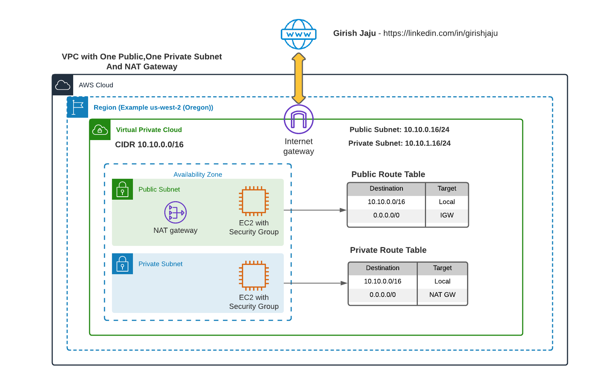

# Setup AWS VPC with One Public And One Private Subnets and NAT Gateway

## Prerequisite
Please follow the part 1, where we created the VPC, Public Subnet and Part 2 where we created Private Subnet
### Link: [VPC With One Public Subnet](/aws-vpc-and-networking/01-vpc-one-public-subnet/)
### Link: [VPC With Public And Private Subnet](/aws-vpc-and-networking/02-vpc-public-private-subnets/)

## Architecure

## Detailed Steps:
### Create NAT Gateway
1. On the VPC-1, we have already create Public and Private Subnets and their Route tables (See Prerequisite)
2. Create a NAT Gateway in the Public Subnet
3. On the Route table associated with Private Subnet (VPC-1-Private-RT), Add the following Route:
0.0.0.0/0 => NAT Gateway

### EC2 on VPC 1 - Private Subnet
1. See the previous section on how to ssh to EC2 instance in Private Subnet (See Prerequisite)
2. Verify the following commands are working
    - ping google.com
    - aws s3 ls

### Conclusion

Successfully created a NAT Gateway in the VPC. 
Attached NAT Gateway to the Private Subnet's Route table to provide it a way to access Internet.
Able to access services like S3 and ping google.com

### Cleanup
NAT Gateway and Elastic IP costs $$$
- Delete the Nat Gateway
- Release the Elastic IP 

- Optioanl: After they are deleted, check the following commands are NOT working, as there is no Route to Internet
    - ping google.com
    - aws s3 ls