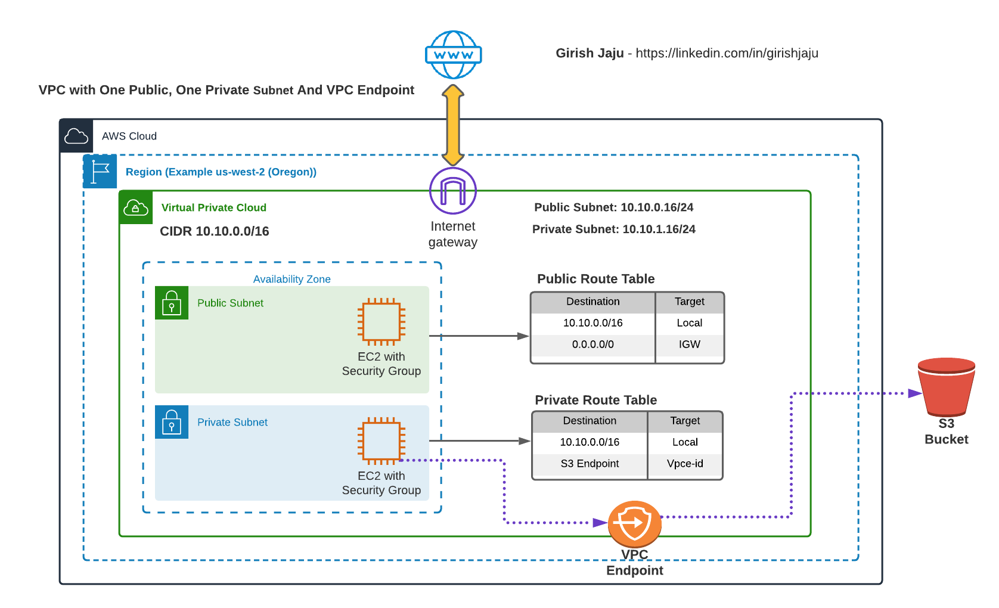

# Setup AWS VPC with One Public And One Private Subnets and VPC Endpoint For S3

## Prerequisite
Please follow the part 1 & 2, where we created the VPC, Public Subnet and Part 2 where we created Private Subnet
### Link: [VPC With One Public Subnet](/aws-vpc-and-networking/01-vpc-one-public-subnet/)
### Link: [VPC With Public And Private Subnet](/aws-vpc-and-networking/02-vpc-public-private-subnets/)

## Architecure

## Detailed Steps:
### EC2 on VPC 1 - Private Subnet
1. See the previous section on how to ssh to EC2 instance in Private Subnet (See Prerequisite)
2. Verify the following commands are NOT working
    - ping google.com
    - aws s3 ls

### Create VPC Endpoint
1. In VPC-1 (Created in Step 1, See prerequisite) 
2. Create VPC End point named vpc-1-s3-vpce
3. Choose Service S3, Type: Gateway, VPC: VPC-1
4. Choose Private Subnet created in Part2, VPC-1-Private-Subnet
5. Save
6. Check the Private Subnet's Route, A new Route should appear connecting to S3 via VPC Endpoint

### EC2 on VPC 1 - Private Subnet
1. Verify the following command is working:
    - aws s3 ls
2. Verify the following command is NOT working
    - ping google.com

### Conclusion

Successfully created a VPC End point for S3 service and attached to Private Subnet's Route table
The S3 service is accessible from the Private instance
Other outbound connections are still DENIED (can't ping google.com)

### Cleanup
Delete the VPC End point
- Optioanl: After they are deleted, check the following command is NOT working, as there is no Route to Internet
    - aws s3 ls