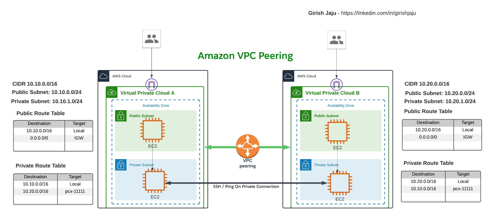

# Setup AWS VPC Peering
Establish private connection between 2 VPCs.

## Architecure

## Detailed Steps:

### Setup VPC 1
1. Create a VPC named VPC-1, in us-west-2 (Oregon region) with CIDR range 10.10.0.0/16
2. Create an Internet Gateway
3. Associate Internet Gateway to the VPC
4. Create a Public Subnet named VPC-1-Public-Subnet with CIDR range (10.10.0.0/24)
5. Make sure Subnet setting has Auto assign Public IP, so the EC2 machine can get a Public IP (along with Private IP), we need it for SSH access
5. Create a Route table named (VPC-1-Public-RT)
6. Add a route to 0.0.0.0/0 to Internet Gateway
7. Add VPC-1-Public-Subnet to the Route table
8. Create a Subnet named VPC-1-Private-Subnet with CIDR range (10.10.1.0/24)
9. Create a Route table named (VPC-1-Private-RT)
10. Add VPC-1-Private-Subnet to the Route table
11. Create the Key Value Pair (For SSH'ing to EC2)

### Setup VPC 2
1. Create a VPC named VPC-2, in us-east-2 (Ohio region) with CIDR range 10.20.0.0/16
2. Create an Internet Gateway
3. Associate Internet Gateway to the VPC
4. Create a Public Subnet named VPC-2-Public-Subnet with CIDR range (10.20.0.0/24)
5. Make sure Subnet setting has Auto assign Public IP, so the EC2 machine can get a Public IP (along with Private IP), we need it for SSH access
5. Create a Route table named (VPC-2-Public-RT)
6. Add a route to 0.0.0.0/0 to Internet Gateway
7. Add VPC-2-Public-Subnet to the Route table
8. Create a Subnet named VPC-2-Private-Subnet with CIDR range (10.20.1.0/24)
9. Create a Route table named (VPC-2-Private-RT)
10. Add VPC-2-Private-Subnet to the Route table
11. Create the Key Value Pair (For SSH'ing to EC2)

### Launch 2 EC2 instances in VPC 1
#### Launch on Public Subnet
- Lauch an EC2 machine with t2.micro
- On the Security Group setting, create a new Security Group - VPC-1-Public-SG  
   Allow SSH access from your IP Address 

#### Launch on Private Subnet
- Lauch an EC2 machine with t2.micro
- On the Security Group setting, create a new Security Group - VPC-1-Private-SG  
   Allow SSH access from EC2 instance in Public Subnet, (VPC-1-Public-SG)  
   Also allow SSH and ICMP (Ping) from VPC-2 CIDR range

#### Test
- SSH to the Public EC2 instance in VPC-1
- Copy the Pem file to the EC2 instance
- From the Public EC2 instance SSH to Private EC2 instance.

### Launch 2 EC2 instances in VPC 2
#### Launch on Public Subnet
- Lauch an EC2 machine with t2.micro
- On the Security Group setting, create a new Security Group - VPC-2-Public-SG  
   Allow SSH access from your IP Address 

#### Launch on Private Subnet
- Lauch an EC2 machine with t2.micro
- On the Security Group setting, create a new Security Group - VPC-2-Private-SG  
   Allow SSH access from EC2 instance in Public Subnet, (VPC-2-Public-SG)  
   Also allow SSH and ICMP (Ping) from VPC-1 CIDR range

#### Test
- SSH to the Public EC2 instance in VPC-2
- Copy the Pem file to the EC2 instance
- From the Public EC2 instance SSH to Private EC2 instance.

#### Test Connectivity between Private instances
- From VPC-1's private instance, ping EC2 in VPC-2's private subnet, should fail
- From VPC-2's private instance, ping EC2 in VPC-1's private subnet, should fail

### Create VPC Peering
1. In AWS console, in VPC-1's region (us-west-2), go to VPC > VPC Peering > Create Peering Connection
2. Give a name to the connection (VPC-1-to-2-Peering)
3. Select VPC-1 as the local (or requester VPC)
4. Since we are peering 2 VPCs in the same account in different regions, choose Another Region
5. Get the VPC-2's id from other region and enter in the box
6. Click create peering connection
7. Go to other VPC and accept the connection, this will establish the peering
8. Copy the connection id (pcx-xxxx), we will need it in the route table

### Modify Route Tables
1. In VPC-1, in the Private Route table VPC-1-Private-RT, add a route for 10.20.0.0/16 (VPC-2's cidr) to use VPC peering connection id.
2. In VPC-2, in the Private Route table VPC-2-Private-RT, add a route for 10.10.0.0/16 (VPC-1's cidr) to use VPC peering connection id.

### Test Connectivity
-  Ping the EC2's in differnt VPCs on the Private IP address, it should work.
-  Note: Make sure the Security group is allowing ICMP protocol from the appropriate CIDR ranges.

### Conclusion

- Successfully created a VPCs and VPC Peering connection between them
- Able to test by pinging EC2 instances created in Private Subnets

### Cleanup
- Delete EC2 instances in both VPC-1 and VPC-2
- Delete Peering connection
- Delete VPCs and associated route tables, Internet gateways